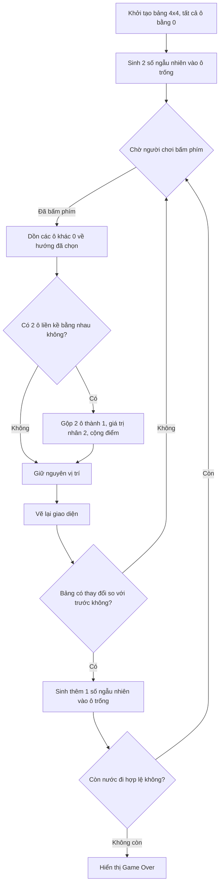

# Dự án Game 2048 (C++)

- **Môn học:** Lập trình nâng cao
- **Mã LHP:** INT2215 21
- **Nhóm:** 05

Dự án này là game 2048 viết bằng ngôn ngữ C++. Phần giao diện đồ họa sử dụng thư viện SDL2.

## Chức năng chính

- Tạo bảng lưới 4x4.
- Nhận phím từ người chơi (phím mũi tên hoặc W/A/S/D) để di chuyển các ô số.
- Hiển thị bảng số bằng các ô vuông bo góc với màu sắc khác nhau.
- Cập nhật điểm hiện tại và lưu điểm cao nhất.

## Quy trình hoạt động

Game chạy theo 4 bước:

1. **Khởi tạo**: Bảng 4x4 ban đầu tất cả ô đều bằng 0. Sinh ngẫu nhiên 2 số (2 hoặc 4) vào 2 ô trống.
2. **Chờ phím**: Chờ người chơi bấm phím để chọn hướng di chuyển (Trái/Phải/Lên/Xuống).
3. **Di chuyển và gộp số**:
   - Dồn tất cả ô có giá trị khác 0 về phía người chơi chọn.
   - Nếu 2 ô liền kề có giá trị bằng nhau thì gộp thành 1 ô có giá trị gấp đôi.
   - Cập nhật điểm.
4. **Kiểm tra kết thúc**: Sau mỗi lần di chuyển thành công, sinh thêm 1 số mới vào ô trống. Nếu tất cả 16 ô đã đầy và không còn 2 ô liền kề nào bằng nhau thì hiển thị Game Over.

Sơ đồ xử lý:



## Cấu trúc thư mục

```text
Game 2048/
├── build/                 # Thư mục chứa các file thực thi sau khi biên dịch
│   ├── Game2048.exe       # File game sau khi build
│   └── run_test.exe       # File test sau khi build
├── src/                   # Thư mục chứa mã nguồn chính
│   ├── logic.h            # Khai báo cấu trúc và các hàm logic của game
│   ├── logic.cpp          # Triển khai phần xử lý thuật toán dồn ô, gộp số và tính điểm
│   └── main.cpp           # Thiết kế giao diện bằng SDL2 và vòng lặp trò chơi
├── tests/                 # Thư mục chứa các file kiểm thử (Unit test)
│   └── test_logic.cpp     # File kiểm tra logic hệ thống
├── Makefile               # File kịch bản cấu hình cho quá trình tự động theo dõi và build source
└── README.md              # Tài liệu cập nhật thông tin dự án
```

## Ví dụ xử lý (Input/Output)

Giả sử có một hàng với giá trị: `[2, 2, 4, 0]`.
- **Input**: Người chơi bấm phím **sang trái**.
- **Output**: 2 ô giá trị 2 liền kề được gộp thành 4. Kết quả: `[4, 4, 0, 0]`.

## Chạy Unit Test

Dự án có file test trong thư mục `tests`, dùng để kiểm tra logic xử lý (không cần giao diện đồ họa).

Chạy bằng lệnh:
```bash
mingw32-make test
# (Hoặc `make test` đối với Linux/macOS)
```

## Chạy game đầy đủ (có giao diện)

Game cần được cài thư viện SDL2, SDL2_gfx, SDL2_ttf trước. Dự án đã có sẵn `Makefile` rất dễ dàng sử dụng.

Mở Terminal / Command Prompt tại thư mục chứa dự án và chạy các lệnh dưới đây:

**Trên Windows (dùng MinGW/MSYS2):**
```bash
# Lệnh build thành file exe
mingw32-make

# Lệnh khởi chạy
.\build\Game2048.exe
```

**Trên Linux / macOS:**
```bash
# Lệnh build
make

# Lệnh khởi chạy
./build/Game2048
```

> **Lưu ý:** Nếu muốn tự chạy kiểm tra unit test hoặc dọn dẹp thư mục: dùng lệnh `make test` hoặc `make clean`.