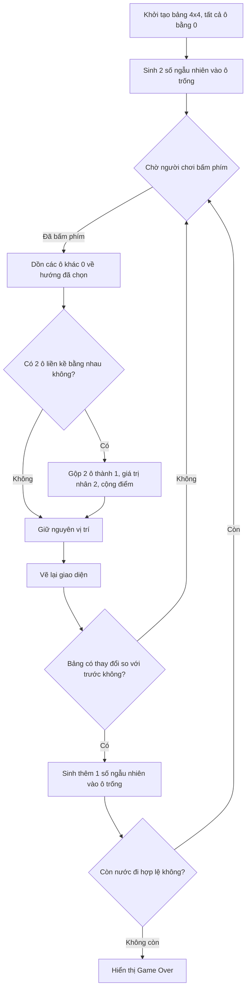

# Dự án Game 2048 (C++)

Dự án này là game 2048 viết bằng C++. Phần logic xử lý bằng C++ cơ bản. Phần giao diện đồ họa dùng thư viện SDL2.

## Chức năng chính

- Tạo bảng lưới 4x4.
- Nhận phím từ người chơi (phím mũi tên hoặc W/A/S/D) để di chuyển các ô số.
- Hiển thị bảng số bằng các ô vuông bo góc với màu sắc khác nhau.
- Cập nhật điểm hiện tại và lưu điểm cao nhất.

## Quy trình hoạt động

Game chạy theo 4 bước:

1. **Khởi tạo**: Bảng 4x4 ban đầu tất cả ô đều bằng 0. Sinh ngẫu nhiên 2 số (2 hoặc 4) vào 2 ô trống.
2. **Chờ phím**: Chờ người chơi bấm phím để chọn hướng di chuyển (Trái/Phải/Lên/Xuống).
3. **Di chuyển và gộp số**:
   - Dồn tất cả ô có giá trị khác 0 về phía người chơi chọn.
   - Nếu 2 ô liền kề có giá trị bằng nhau thì gộp thành 1 ô có giá trị gấp đôi.
   - Cập nhật điểm.
4. **Kiểm tra kết thúc**: Sau mỗi lần di chuyển thành công, sinh thêm 1 số mới vào ô trống. Nếu tất cả 16 ô đã đầy và không còn 2 ô liền kề nào bằng nhau thì hiển thị Game Over.

Sơ đồ xử lý:



## Ví dụ xử lý (Input/Output)

Giả sử có một hàng với giá trị: `[2, 2, 4, 0]`.
- **Input**: Người chơi bấm phím **sang trái**.
- **Output**: 2 ô giá trị 2 liền kề được gộp thành 4. Kết quả: `[4, 4, 0, 0]`.

## Chạy Unit Test

Dự án có file test trong thư mục `tests`, dùng để kiểm tra logic xử lý (không cần giao diện đồ họa).

Chạy bằng lệnh:
```bash
g++ tests/test_logic.cpp src/logic.cpp -o run_test.exe
./run_test.exe
```

## Chạy game đầy đủ (có giao diện)

Game cần cài thư viện SDL2, SDL2_gfx, SDL2_ttf trước khi build.

**Windows (MinGW):**
```bash
g++ src/main.cpp src/logic.cpp -o Game2048.exe -I <đường dẫn thư mục include SDL2> -L <đường dẫn thư mục lib SDL2> -lmingw32 -lSDL2main -lSDL2 -lSDL2_gfx -lSDL2_ttf
./Game2048.exe
```

**Linux / macOS:**
```bash
g++ src/main.cpp src/logic.cpp -o Game2048 `pkg-config --cflags --libs sdl2 SDL2_gfx SDL2_ttf`
./Game2048
```