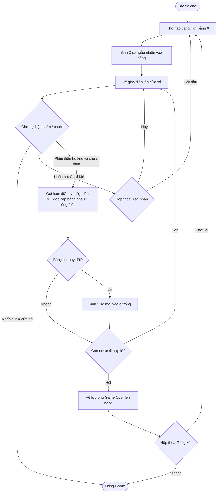

<div align="center">
  <h1>Game 2048 (C++ & SDL2)</h1>

  [](https://cplusplus.com/)
  [](https://www.libsdl.org/)
</div>

---

## 1. Giới thiệu dự án

Dự án phát triển trò chơi 2048 viết bằng ngôn ngữ C++. Phần giao diện đồ họa được xử lý bằng thư viện SDL2. 

- **Môn học:** Lập trình nâng cao
- **Mã LHP:** INT2215 21
- **Nhóm:** 05

## 2. Chức năng chính

- Khởi tạo bảng lưới 4x4 hiển thị tự động.
- Nhận luồng điều khiển qua bàn phím (Phím mũi tên hoặc W, A, S, D) để dồn các ô số.
- Cập nhật tự động ma trận lưới thông qua cơ chế gộp ô cùng giá trị.
- Hiển thị điểm số hiện tại và điểm kỷ lục chơi.
- Bật hộp thoại xác nhận khi dùng nút Chơi Mới để tránh mất dữ liệu tiến trình do bấm nhầm.
- Hiển thị hộp thoại tổng kết khi kết thúc ván (Game Over), cung cấp tùy chọn chơi lại hoặc thoát chương trình.
- Cấu trúc source code tổ chức minh bạch có tách rời phần logic và phần giao diện.

---

## 3. Cấu trúc thư mục

```text
Game 2048/
├── build/                 # Thư mục chứa file thực thi (.exe) sau khi biên dịch
│   ├── Game2048.exe       # Tệp khởi chạy trò chơi
│   └── run_test.exe       # Tệp kiểm thử bộ điều hướng logic
├── src/                   # Thư mục chứa mã nguồn chính của dự án 
│   ├── logic.h            # Khai báo cấu trúc biến và các hàm logic nội tại
│   ├── logic.cpp          # Triển khai thuật toán sinh số, dịch chuyển và quy đổi logic
│   └── main.cpp           # Xử lý vòng lặp đồ họa bằng SDL2 và nhận diện phím bấm
├── tests/                 # Thư mục chứa các script độc lập kiểm thử Unit Test
│   └── test_logic.cpp     # File kiểm tra tính chính xác của hàm xử lý bảng ô số
├── Makefile               # File cấu hình lệnh tự động môi trường biên dịch hệ thống
└── README.md              # Tài liệu mô tả cấu trúc và hoạt động của dự án
```

---

## 4. Sơ đồ luồng xử lý

Mô hình miêu tả quá trình vận hành vòng đời dữ liệu của game:



## 5. Ví dụ xử lý (Input/Output thuật toán gộp)

Quá trình gộp được tính thông qua input trực tiếp. Dưới đây là ví dụ đường trượt cơ bản.
- Biến mảng đầu vào: `[2, 2, 4, 0]`
- Điều kiện Input: Nhập dịch chuyển sang hướng bên TRÁI.
- Output sinh ra: 2 ô giá trị `2` dồn lại gộp thành `4`.
- Kết quả cập nhật: `[4, 4, 0, 0]`

---

## 6. Hướng dẫn cài đặt và biên dịch

Hệ thống máy tính cần cấu hình trình biên dịch C++ (`gcc`, `g++`) và chương trình `make`. Dự án yêu cầu liên kết thư viện đồ họa `SDL2`, `SDL2_gfx` và `SDL2_ttf`.

### Trên hệ điều hành Windows
Mở Terminal hoặc Command Prompt tại thư mục chứa dự án.

**Bước 1: Biên dịch chương trình**
```bash
mingw32-make
```

**Bước 2: Khởi chạy trò chơi**
```bash
.\build\Game2048.exe
```

### Trên hệ điều hành macOS / Linux
**Bước 1: Biên dịch chương trình**
```bash
make
```

**Bước 2: Khởi chạy trò chơi**
```bash
./build/Game2048
```

---

## 7. Chạy Unit Test và Dọn dẹp rác bộ nhớ

Dành cho môi trường theo dõi dữ liệu không thông qua đồ hoạ:

**Chạy kiểm thử logic độc lập:**
Phần test code kiểm tra sự độc lập của thuật toán nằm tại `tests/test_logic.cpp`.
```bash
# Đối với Windows
mingw32-make test

# Đối với macOS / Linux
make test
```

**Xoá tệp thực thi kết quả lưu lại từ build cũ:**
```bash
# Đối với Windows
mingw32-make clean

# Đối với macOS / Linux
make clean
```