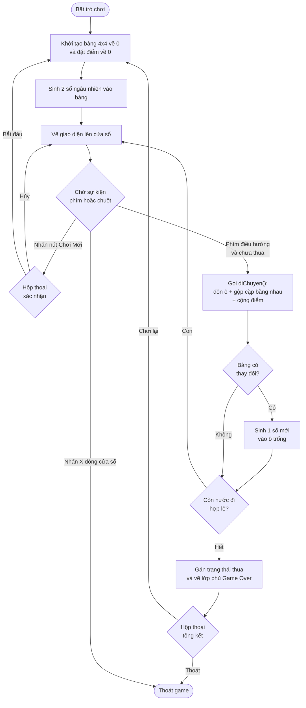

<div align="center">
  <h1>Game 2048 (C++ & SDL2)</h1>

  [](https://cplusplus.com/)
  [](https://www.libsdl.org/)
</div>

---

## 1. Giới thiệu dự án

Dự án phát triển trò chơi 2048 viết bằng ngôn ngữ C++. Phần giao diện đồ họa được xử lý bằng thư viện SDL2. 

- **Môn học:** Lập trình nâng cao
- **Mã LHP:** INT2215 21
- **Nhóm:** 05

## 2. Chức năng chính

- Khởi tạo bảng 4x4 và hiển thị lên cửa sổ.
- Nhận phím bấm từ bàn phím (phím mũi tên hoặc W, A, S, D) để dồn các ô số.
- Gộp 2 ô cùng giá trị khi nằm liền kề theo hướng di chuyển và cộng điểm.
- Hiển thị điểm số hiện tại và điểm kỷ lục.
- Hiển thị hộp thoại xác nhận khi bấm nút Chơi Mới để tránh mất tiến trình do bấm nhầm.
- Hiển thị hộp thoại tổng kết khi thua (Game Over), cho phép chơi lại hoặc thoát.
- Tách rời phần logic và phần giao diện thành các file riêng.

---

## 3. Cấu trúc thư mục

```text
Game 2048/
├── assets/                # Thư mục chứa font (không được commit lên GitHub)
│   └── font.ttf           # Font chữ dùng để vẽ số và tiêu đề (tự thêm vào)
├── build/                 # Thư mục chứa file thực thi sau khi biên dịch
│   └── .gitkeep           # File rỗng để git giữ lại thư mục build/ sau khi clone
├── src/                   # Thư mục chứa mã nguồn chính
│   ├── logic.h            # Khai báo biến toàn cục và các hàm xử lý logic
│   ├── logic.cpp          # Xử lý sinh số, di chuyển ô, gộp số, tính điểm
│   └── main.cpp           # Vòng lặp game SDL2, xử lý sự kiện và vẽ giao diện
├── tests/                 # Thư mục chứa file unit test
│   └── test_logic.cpp     # Test các hàm xử lý logic game
├── Makefile               # Cấu hình lệnh biên dịch (build, run, test, clean)
└── README.md              # Tài liệu mô tả dự án
```

---

## 4. Sơ đồ luồng xử lý

Sơ đồ mô tả luồng xử lý chính của game:



## 5. Ví dụ xử lý (Input/Output thuật toán gộp)

Ví dụ gộp ô khi di chuyển sang trái:
- Mảng đầu vào: `[2, 2, 4, 0]`
- Hướng di chuyển: TRÁI
- Kết quả: 2 ô giá trị `2` gộp thành `4` → `[4, 4, 0, 0]`

---

## 6. Hướng dẫn cài đặt và biên dịch

Dự án cần: trình biên dịch `g++`, lệnh `make`, và 3 thư viện `SDL2`, `SDL2_gfx`, `SDL2_ttf`.

---

### Trên hệ điều hành Windows

Dự án dùng **MSYS2** để cung cấp `g++`, `make` và các thư viện SDL2 trên Windows.

**Bước 1: Tải và cài đặt MSYS2**

Tải bộ cài tại: https://www.msys2.org/

Chạy file `.exe` vừa tải, cài vào thư mục mặc định `C:\msys64`.

**Bước 2: Mở terminal MSYS2 UCRT64**

Sau khi cài xong, mở **MSYS2 UCRT64** từ Start Menu (không dùng MINGW64 hay MSYS2).

**Bước 3: Cập nhật package database**
```bash
pacman -Syu
```
Nếu terminal tự đóng sau khi chạy xong, mở lại MSYS2 UCRT64 rồi chạy tiếp:
```bash
pacman -Su
```

**Bước 4: Cài g++ và make**
```bash
pacman -S mingw-w64-ucrt-x86_64-gcc
pacman -S mingw-w64-ucrt-x86_64-make
```

**Bước 5: Cài 3 thư viện SDL2**
```bash
pacman -S mingw-w64-ucrt-x86_64-SDL2
pacman -S mingw-w64-ucrt-x86_64-SDL2_gfx
pacman -S mingw-w64-ucrt-x86_64-SDL2_ttf
```

**Bước 6: Thêm đường dẫn vào PATH**

Thêm `C:\msys64\ucrt64\bin` vào biến môi trường PATH của Windows để dùng `g++` và `mingw32-make` từ terminal bất kỳ.

Sau khi thêm xong, **mở terminal mới** để PATH có hiệu lực.

**Bước 7: Chuẩn bị font**

Font không được commit lên GitHub. Sau khi clone về, chạy lệnh sau để tạo thư mục `assets/` và sao chép font:
```bash
mkdir assets
copy C:\Windows\Fonts\arialbd.ttf assets\font.ttf
```

**Bước 8: Biên dịch và chạy game**

Mở terminal tại thư mục dự án, chạy lần lượt:
```bash
mingw32-make
.\build\Game2048.exe
```

---

### Trên hệ điều hành macOS

**Bước 1: Cài Homebrew** (nếu chưa có)

Xem hướng dẫn tại: https://brew.sh/

**Bước 2: Cài 3 thư viện SDL2**
```bash
brew install sdl2 sdl2_gfx sdl2_ttf
```

**Bước 3: Chuẩn bị font**

Game đọc font tại `assets/font.ttf`. Tạo thư mục `assets/` và sao chép font vào:
```bash
mkdir -p assets
cp /System/Library/Fonts/Supplemental/Arial\ Bold.ttf assets/font.ttf
```
Nếu không có file đó, dùng font khác có sẵn trên máy (phải là file `.ttf`):
```bash
# Tìm file .ttf có sẵn trên máy
find /System/Library/Fonts /Library/Fonts -name "*.ttf" | head -5
# Sao chép 1 file bất kỳ tìm được
cp <đường_dẫn_file_ttf> assets/font.ttf
```

**Bước 4: Biên dịch và chạy game**
```bash
make
./build/Game2048
```

---

### Trên hệ điều hành Linux (Ubuntu / Debian)

**Bước 1: Cài g++, make và 3 thư viện SDL2**
```bash
sudo apt install g++ make libsdl2-dev libsdl2-gfx-dev libsdl2-ttf-dev
```

**Bước 2: Chuẩn bị font**

Game đọc font tại `assets/font.ttf`. Cài font, tạo thư mục `assets/` và sao chép font vào:
```bash
sudo apt install fonts-liberation
mkdir -p assets
cp /usr/share/fonts/truetype/liberation/LiberationSans-Bold.ttf assets/font.ttf
```

**Bước 3: Biên dịch và chạy game**
```bash
make
./build/Game2048
```

---

## 7. Chạy Unit Test và dọn dẹp

**Chạy unit test:**
File test nằm tại `tests/test_logic.cpp`, kiểm tra logic game độc lập (không cần SDL2).
```bash
# Đối với Windows
mingw32-make test

# Đối với macOS / Linux
make test
```

**Xóa file thực thi trong build/:**
```bash
# Đối với Windows
mingw32-make clean

# Đối với macOS / Linux
make clean
```